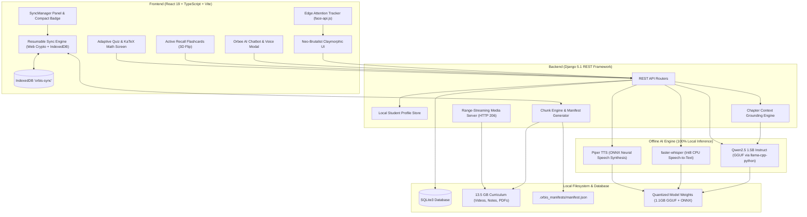

<div align="center">

# 🪐 ORBIS
### **The Sovereign Offline AI Learning Platform for Every Student**

*Empowering rural and low-connectivity education with 100% on-device artificial intelligence, localized curriculum, edge vision attention tracking, and resumable chunked delta-sync.*

[](https://www.sih.gov.in/)
[](#)
[](#)
[](#)
[](#)

[Features](#-core-features) • [Architecture](#-system-architecture) • [Sync Protocol](#-chunked-download--delta-sync-engine) • [Quick Start](#-quick-start) • [Offline AI Stack](#-on-device-ai-engine) • [Curriculum](#-curriculum--subjects) • [Team](#-team-alphacenturi)

---

</div>

## 📌 Problem Statement & Vision

Over **60% of rural schools across developing regions** struggle with zero or intermittent internet connectivity. While the world transitions toward AI-powered personalized tutoring, students without reliable broadband or expensive cloud subscriptions are left behind.

**ORBIS** (*Offline Resource-Based Intelligent System*) breaks this barrier. It transforms any basic school laptop or low-power desktop into a **fully self-contained, syllabus-aware AI tutor**:
- **Zero Internet Required**: All neural networks, speech recognition, synthesis, content rendering, and quizzes run natively on the local device CPU without a single cloud request.
- **Syllabus-Grounded**: The AI does not hallucinate generic web trivia; its knowledge base is strictly grounded in NCERT textbook excerpts, teacher notes, and lecture video transcripts.
- **Resumable Chunked Delta Sync**: Teachers and schools can push syllabus updates over weak links or offline local hotspots. Only modified byte chunks are downloaded, verifying SHA-256 integrity before saving.
- **Privacy-Preserving Edge Vision**: Tracks student attention passively via browser-based computer vision without streaming camera data anywhere.

---

## ✨ Core Features

### 1. 🤖 Orbee — The Sovereign On-Device AI Tutor
- **Context-Grounded Doubt Clearing**: Ask questions via text or spoken voice. Orbee answers exclusively using concepts from the active chapter context.
- **On-Device Speech-to-Text (STT)**: Powered by local `faster-whisper` (int8 quantized) for low-latency spoken voice queries.
- **Natural Voice Synthesis (TTS)**: Real-time neural audio output generated locally via `Piper TTS`.
- **Lecture Summarization**: Generates concise, bulleted revision takeaways and formula sheets directly from video transcripts and chapter notes with one click.
- **Multilingual Support**: Native language processing across English, Kannada, and Hindi tailored for regional curricula.

### 2. 🔄 Resumable Chunked Download & Delta Sync *(New Major Engine)*
- **Differential Updates (Delta Sync)**: Rather than re-downloading entire multi-gigabyte files, ORBIS compares client manifests against the server and downloads *only* new or modified chunks.
- **Granular Deterministic Slicing**: Slices content into verified chunks (512 KB default, 1 MB for video, 256 KB for PDFs/PPTs).
- **Cryptographic SHA-256 Integrity**: Every individual chunk and complete file is verified using the browser's native **Web Crypto API**.
- **IndexedDB Resumability**: Transfer progress is tracked in `orbis-sync` (IndexedDB). If a connection drops, the download resumes seamlessly from the exact last successful chunk without restarting.
- **Live Sync Dashboard**: Real-time progress bars, chunk counts, rolling average speed (`KB/s`), live ETA estimation, and pause/resume/cancel controls.

### 3. 👁️ Edge Vision Focus & Attention Tracker
- **100% On-Device Face Detection**: Powered by `face-api.js` running in the browser using WebGL and WebAssembly.
- **Zero Telemetry**: Webcams operate strictly in memory; no frames or biometrics ever leave the device.
- **Gentle Refocus Interventions**: If a student looks away or steps away for more than 10 seconds during an interactive video lesson, playback automatically pauses and presents a supportive refocus modal: *"Are you still there? Let's stay focused on the lesson!"*

### 4. 🎴 Active Recall Flashcards
- **Interactive 3D Flipping**: Visual tactile feedback simulating real flashcards.
- **Mastery Tracking**: Students mark cards as *"Mastered"* or *"Needs Practice"*, dynamically driving an animated mastery progress meter.
- **Shuffle & Keyboard Navigation**: Full accessibility controls (<kbd>Space</kbd>/<kbd>Enter</kbd> to flip, <kbd>←</kbd>/<kbd>→</kbd> to navigate, <kbd>M</kbd> to toggle mastery).

### 5. 📝 Adaptive Chapter Quizzes & AI Diagnostics
- **On-the-Fly Generation**: AI synthesizes curriculum-aligned multiple-choice questions per chapter.
- **Scientific Math Rendering**: Full LaTeX math and formula rendering powered by **KaTeX** (`remark-math` + `rehype-katex`).
- **Offline Root-Cause Diagnostics**: Incorrect answers trigger an automatic AI diagnostic analysis explaining *why* the student's answer was mistaken and identifying **Weak Concepts** for revision.

### 6. 📊 Multi-Student Profiles & Learning Analytics
- **Shared Device Support**: Accommodates multiple students on shared rural classroom computers with individualized profiles and avatars.
- **Activity & Streak Heatmaps**: GitHub-style visual engagement calendar logging daily study sessions, completed quizzes, and videos watched.
- **Progress Tracking**: Tracks video completion, notes read, summary status, and quiz scores per chapter.

### 7. 🎨 Neo-Brutalist "Claymorphic" UI
- Built with a tactile, high-contrast, playful aesthetic designed specifically for young learners (Grade 5+).
- Tactile clay cards, interactive button springs, custom themed scrollbars, and full keyboard focus rings.
- 100% responsive across mobile viewports (down to 375px) and desktop monitors.

---

## 🏛️ System Architecture



---

## 🔄 Chunked Download & Delta Sync Engine

ORBIS features an industrial-grade delta update protocol optimized for slow, unreliable, or intermittent network links:

| Feature | Technical Implementation | Impact |
|---|---|---|
| **Chunking** | 512 KB default (1 MB video, 256 KB PDF) | Prevents socket timeouts on weak connections |
| **Integrity** | SHA-256 computed per chunk + full file | Guarantees zero byte corruption |
| **Delta Engine** | Server-side manifest diff calculation | Downloads *only* missing/changed chunks |
| **Resumability** | Chunk progress saved in IndexedDB | Resumes instantly from the last byte after disconnects |
| **Cache Strategy** | Sidecar `.orbis_manifests/` with `mtime` checks | Zero database queries; instant manifest serving |
| **Concurrency** | Throttled parallel chunk streams (2 concurrent) | Gentle on slow routers and school hotspots |

### Sync API Endpoints

| Endpoint | Method | Purpose |
|---|---|---|
| `/api/sync/manifest/` | `GET` | Returns complete server manifest with chunk SHA-256 metadata |
| `/api/sync/diff/` | `POST` | Accepts client manifest, returns minimal differential download plan |
| `/api/sync/chunk/<path>` | `GET` | Serves an isolated chunk with `X-Chunk-SHA256` verification header |
| `/api/sync/file-manifest/<path>/` | `GET` | Returns chunk metadata for a single specific file |
| `/api/sync/regenerate/` | `POST` | Force-regenerates cached manifest after teacher content updates |

---

## 🛠️ Technology Stack

| Layer | Technologies | Description |
|---|---|---|
| **Frontend** | React 19, TypeScript, Vite 8 | Modern reactive UI with ultra-fast build toolchain |
| **Styling** | Tailwind CSS v4, Vanilla CSS | Tactile claymorphic tokens & neo-brutalist theme |
| **Math & Science** | KaTeX, Remark-Math, Rehype-KaTeX | Synchronous, zero-latency LaTeX equation rendering |
| **Edge Vision** | `face-api.js` (TinyFaceDetector) | In-browser face & attention detection via WebGL/WASM |
| **Local Client DB** | IndexedDB (`idb` wrapper) | Resumable chunk storage, manifests, and file state |
| **Icons** | Lucide React | High-contrast accessible iconography |
| **Backend** | Django 5.1, Django REST Framework | Robust offline REST API and media management |
| **Database** | SQLite 3 | Lightweight zero-config embedded SQL database |
| **Local LLM** | Qwen 2.5 1.5B Instruct (Q4_K_M GGUF) | Multi-threaded CPU inference via `llama-cpp-python` |
| **Local STT** | Faster-Whisper (Base int8) | Low-latency on-device speech recognition |
| **Local TTS** | Piper TTS (`en_US-lessac-medium.onnx`) | Natural-sounding offline neural voice synthesis |

---

## 📂 Project Structure

```
ORBIS/
├── backend/                        # Django Backend & Offline Services
│   ├── ai_engine/                  # Local On-Device AI Pipeline
│   │   ├── services.py             # LLMService, STTService, TTSService
│   │   ├── context.py              # Textbook & transcript grounding engine
│   │   ├── prompts.py              # Pedagogical system prompts (multilingual)
│   │   └── views.py                # Chat, Quiz, Voice, Summary API endpoints
│   ├── api/                        # Database Models, Serializers & Views
│   │   ├── models.py               # Student, Chapter, Quiz, Activity models
│   │   ├── chunk_engine.py         # SHA-256 chunking & differential delta engine
│   │   ├── chunk_views.py          # Delta-sync REST endpoints
│   │   ├── media_views.py          # HTTP 206 Partial Content video streaming
│   │   ├── media_scanner.py        # Automatic filesystem curriculum scanner
│   │   └── management/commands/
│   │       └── seed_content.py     # Curriculum population script
│   ├── educarnival/                # Django project configuration & settings
│   ├── media/                      # Curricula storage (Videos, PDFs, PPTs)
│   │   └── .orbis_manifests/       # Cached SHA-256 sync manifests
│   ├── models/                     # Downloaded AI model weights (GGUF & ONNX)
│   ├── download_models.py          # Automated model downloader script
│   ├── manage.py
│   └── requirements.txt            # Python dependencies
│
├── frontend/                       # React 19 + TypeScript Frontend
│   ├── src/
│   │   ├── components/             # Reusable UI Components
│   │   │   ├── AIChatbot.tsx       # Orbee AI tutor with LaTeX math & voice
│   │   │   ├── AttentionTracker.tsx# Edge vision face-detection focus tracker
│   │   │   ├── SyncManager.tsx     # Resumable sync dashboard & status badge
│   │   │   ├── Header.tsx          # App navigation & profile indicator
│   │   │   └── ProgressIndicator.tsx
│   │   ├── lib/                    # Core Client Libraries
│   │   │   ├── syncEngine.ts       # Chunked downloader with SHA-256 Web Crypto
│   │   │   └── syncDb.ts           # IndexedDB persistence wrapper
│   │   ├── pages/                  # Application Views
│   │   │   ├── SelectProfile.tsx   # Multi-student local profile picker
│   │   │   ├── Registration.tsx    # One-time student onboarding (Grades 1-10)
│   │   │   ├── Dashboard.tsx       # Subject grid & chapter counts
│   │   │   ├── ChapterList.tsx     # Chapter selection
│   │   │   ├── ChapterContent.tsx  # Video player, notes, PDF viewer & AI hub
│   │   │   ├── FlashcardScreen.tsx # 3D active recall flashcards with mastery
│   │   │   ├── QuizScreen.tsx      # Adaptive quiz with timer & AI diagnostics
│   │   │   ├── ProgressDashboard.tsx # Learning analytics & study streak heatmap
│   │   │   └── Profile.tsx         # Student profile details
│   │   ├── index.css               # Claymorphic neo-brutalist design tokens
│   │   ├── api.ts                  # Axios HTTP client configuration
│   │   └── App.tsx                 # Client routing
│   ├── package.json
│   └── vite.config.ts
├── PRD.md                          # Comprehensive Product Requirements Document
└── README.md                       # Project documentation
```

---

## 🚀 Quick Start

### Prerequisites
- **Python 3.10+** (Tested on Python 3.12)
- **Node.js 18+** & **npm**
- **Git**

---

### Step 1: Clone the Repository
```bash
git clone https://github.com/TarunDavid/ORBIS.git
cd ORBIS
```

---

### Step 2: Backend Setup & Model Download

1. Open a terminal and navigate to `backend/`:
   ```bash
   cd backend
   ```

2. Install Python dependencies:
   ```bash
   pip install -r requirements.txt
   ```

3. **Download the Offline AI Models (one-time setup)**:
   Downloads the lightweight **Qwen2.5 1.5B GGUF** and **Piper TTS voice** (~1.2 GB total):
   ```bash
   python download_models.py
   ```

4. Run database migrations:
   ```bash
   python manage.py migrate
   ```

5. Seed the initial syllabus (Mathematics, Science, English, Kannada, Hindi):
   ```bash
   python manage.py seed_content
   ```

6. Start the local Django server:
   ```bash
   python manage.py runserver 0.0.0.0:8000
   ```
   *The backend will be live at `http://127.0.0.1:8000`.*

---

### Step 3: Frontend Setup

1. Open a **second terminal** and navigate to `frontend/`:
   ```bash
   cd frontend
   ```

2. Install npm dependencies:
   ```bash
   npm install
   ```

3. Start the Vite development server:
   ```bash
   npm run dev
   ```
   *The frontend will launch at `http://localhost:5173`.*

---

### Step 4: Explore ORBIS!
Open your browser and navigate to **`http://localhost:5173`**:
1. **Register** a student profile or select an existing profile.
2. Select any **Subject** (e.g. Mathematics, Science, Kannada).
3. Open a **Chapter** to access lecture notes, textbook excerpts, and video lessons.
4. Toggle **Focus Mode** to test the on-device Edge Vision Attention Tracker.
5. Launch **Orbee** to ask questions, solve math formulas with LaTeX, or click **Summarize Video**.
6. Check the **Sync Manager** panel on the Dashboard to inspect or update curriculum packages!

---

## 🧠 On-Device AI Engine

ORBIS is engineered to deliver high-quality pedagogical assistance on consumer-grade hardware without dedicated GPUs:

| Engine | Model | Execution Details | CPU Performance |
|---|---|---|---|
| **Text & Reasoning** | `Qwen2.5-1.5B-Instruct-Q4_K_M.gguf` | 4-bit quantized GGUF via `llama-cpp-python` with 4096 context window | **~21 tokens/sec** on 12-thread CPU |
| **Voice Synthesis** | `en_US-lessac-medium.onnx` | On-device ONNX runtime via Piper TTS | **Instant (< 1s)** audio synthesis |
| **Voice Recognition** | `faster-whisper-base` | Quantized int8 compute on CPU | **Real-time transcription** |
| **Edge Vision** | `face-api.js` (TinyFaceDetector) | In-browser WebGL/WASM computer vision | **Real-time (10 fps check interval)** |

> [!TIP]
> **Cold Start Optimization**: The first inference loads the 1.1GB weights into RAM in ~2-3 seconds. Subsequent queries generate within **3 to 5 seconds**!

---

## 📚 Curriculum & Subjects

The platform comes pre-configured with syllabus-aligned structures for Indian primary and middle school education (CBSE / State Board):

- 📐 **Mathematics**: Shapes & Angles, Parts & Wholes, Numbers, Elementary Shapes (with KaTeX rendering)
- 🔬 **Science**: Super Senses, Digestion, Food & Nutrition, Sorting Materials
- 📖 **English**: Reading comprehension, vocabulary, and grammar stories
- 🌍 **Social Science**: History, Geography, and Community stories
- 🇮🇳 **Hindi**: भाषा और साहित्य (Language and literature)
- 🟡 **Kannada**: ನಮ್ಮ ದೇಶ ನಮ್ಮ ಹೆಮ್ಮೆ, ಶಾಲೆಗೆ ಹೋಗೋಣ ಬನ್ನಿ, ಹಾಡು ಪಾಡು

---

## ⌨️ Accessibility & Keyboard Shortcuts

ORBIS incorporates full keyboard navigation for classroom inclusivity:

| Context | Shortcut | Action |
|---|---|---|
| **Flashcards** | <kbd>Space</kbd> / <kbd>Enter</kbd> | Flip between question & answer |
| **Flashcards** | <kbd>←</kbd> / <kbd>→</kbd> | Navigate to previous / next card |
| **Flashcards** | <kbd>M</kbd> | Toggle "Mastered" status |
| **Quiz** | <kbd>1</kbd> - <kbd>4</kbd> or <kbd>A</kbd> - <kbd>D</kbd> | Select choice option |
| **Quiz** | <kbd>Enter</kbd> or <kbd>→</kbd> | Next question or submit quiz |
| **Quiz** | <kbd>←</kbd> | Return to previous question |

---

## 👥 Team ALPHACENTURI

**Smart India Hackathon 2026**
- **Problem ID**: SIH26205
- **Theme**: Smart Education — Student Innovation

---

## 📄 License

This project is proprietary, confidential, and closed-source. All rights are reserved by **Team ALPHACENTURI** — see the [LICENSE](LICENSE) file for details.
