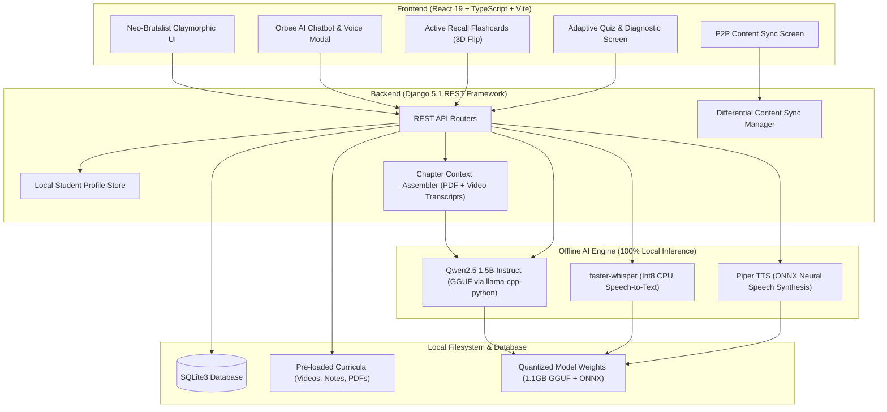

<div align="center">

# 🪐 ORBIS
### **The Sovereign Offline AI Learning Platform for Every Student**

*Empowering rural and low-connectivity education with 100% on-device artificial intelligence, localized curriculum, and peer-to-peer sync.*

[](https://www.sih.gov.in/)
[](#)
[](#)
[](#)
[](#)

[Features](#-core-features) • [Architecture](#-system-architecture) • [Getting Started](#-quick-start) • [Offline AI Stack](#-on-device-ai-engine) • [Curriculum](#-curriculum--subjects) • [Team](#-team-alphacenturi)

---

</div>

## 📌 Problem Statement & Vision

Over **60% of rural schools across developing regions** struggle with zero or intermittent internet connectivity. While the world transitions toward AI-powered personalized tutoring, students without reliable broadband or expensive cloud subscriptions are left behind.

**ORBIS** (Offline Resource-Based Intelligent System) breaks this barrier. It transforms any basic school laptop or low-power desktop into a **fully self-contained, syllabus-aware AI tutor**:
- **Zero Internet Required**: All neural networks, speech recognition, synthesis, content rendering, and quizzes run natively on the local device CPU.
- **Syllabus-Grounded**: The AI does not hallucinate generic web trivia; its knowledge base is grounded directly in NCERT textbook excerpts, teacher notes, and lecture video transcripts.
- **Mesh / Peer-to-Peer Sync**: Teachers can update curriculum and distribute new chapters to students over local offline Wi-Fi without touching the global internet.

---

## ✨ Core Features

### 1. 🤖 Orbee — The On-Device AI Tutor
- **Context-Grounded Doubt Clearing**: Ask questions via text or voice. Orbee answers exclusively using concepts from the active chapter.
- **Speech-to-Text (STT)**: Powered by local `faster-whisper` (int8 quantized) for instant spoken voice queries.
- **Natural Voice Synthesis (TTS)**: Real-time neural audio output generated locally via `Piper TTS`.
- **Lecture Summarization**: Generates concise, bulleted revision takeaways and formula sheets directly from video transcripts and chapter notes.
- **Multilingual Support**: Tailored to state boards with native language processing across English, Kannada, and Hindi.

### 2. 🎴 Active Recall Flashcards
- **Interactive 3D Flipping**: Visual feedback mimicking tactile flashcards.
- **Mastery Tracking**: Students can mark cards as *"Mastered"* or *"Needs Practice"*, updating an animated mastery progress meter in real time.
- **Shuffle Mode**: Randomizes card sequences to eliminate position bias during revision.
- **Full Keyboard Navigation**:
  - <kbd>Space</kbd> / <kbd>Enter</kbd> to flip card
  - <kbd>←</kbd> / <kbd>→</kbd> to navigate
  - <kbd>M</kbd> to toggle mastered status

### 3. 📝 Adaptive Chapter Quizzes
- **On-the-Fly Generation**: AI synthesizes curriculum-aligned multiple-choice questions per chapter.
- **Gamified Testing**: Elapsed timer (`⏱️ mm:ss`), question status indicators, and keyboard shortcuts (<kbd>1-4</kbd> or <kbd>A-D</kbd>).
- **Offline Concept Breakdown**: Incorrect answers trigger an automatic AI diagnostic analysis explaining *why* an answer was wrong and pointing out weak concepts for review.
- **Math & Science Rendering**: Full LaTeX math formula support powered by KaTeX.

### 4. 🎨 Neo-Brutalist "Claymorphic" UI
- Built with a tactile, playful, high-contrast design language tailored for young learners (Grade 5+).
- Tactile clay cards, interactive button springs, custom themed scrollbars, and accessible focus rings.
- 100% responsive across mobile viewports (tested down to 375px) and desktop monitors.

### 5. 🔄 Local Device-to-Device Synchronization
- Authorized teacher or school hubs can distribute new chapters, videos, and worksheets to student laptops over a local hotspot or Wi-Fi Direct.
- Manifest-based differential syncing: downloads only missing or updated assets, verifying SHA-256 integrity before installing.

---

## 🏛️ System Architecture



---

## 🛠️ Technology Stack

| Layer | Technologies | Description |
|---|---|---|
| **Frontend** | React 19, TypeScript, Vite 8 | Ultra-fast build toolchain & strict typing |
| **Styling** | Tailwind CSS v4, Vanilla CSS | Custom claymorphic & neo-brutalist theme tokens |
| **Mathematics** | KaTeX, Remark-Math, Rehype-KaTeX | Native rendering of equations and scientific formulas |
| **Icons** | Lucide React | High-contrast accessible iconography |
| **Backend** | Django 5.1, Django REST Framework | Robust offline REST API and content management |
| **Database** | SQLite 3 | Lightweight zero-config embedded SQL database |
| **Local LLM** | Qwen 2.5 1.5B Instruct (Q4_K_M GGUF) | Multi-threaded CPU inference via `llama-cpp-python` |
| **Local STT** | Faster-Whisper (Base int8) | Low-latency on-device speech-to-text |
| **Local TTS** | Piper TTS (`en_US-lessac-medium.onnx`) | Fast, natural-sounding offline neural voice synthesis |

---

## 📂 Project Structure

```
ORBIS/
├── backend/                        # Django Backend & AI Services
│   ├── ai_engine/                  # Local On-Device AI Pipeline
│   │   ├── services.py             # LLMService, STTService, TTSService
│   │   ├── context.py              # Textbook & transcript grounding engine
│   │   ├── prompts.py              # Pedagogical system prompts
│   │   └── views.py                # Chat, Quiz, Voice, Summary API endpoints
│   ├── api/                        # Database Models, Serializers & Views
│   │   ├── models.py               # Student, Grade, Subject, Chapter, Quiz models
│   │   ├── sync_views.py           # Peer-to-peer import/export sync endpoints
│   │   └── management/commands/
│   │       └── seed_content.py     # Curriculum population script
│   ├── educarnival/                # Django project configuration
│   ├── models/                     # Downloaded AI model weights (GGUF & ONNX)
│   ├── download_models.py          # Automated model downloader script
│   ├── manage.py
│   └── requirements.txt            # Python dependencies
│
├── frontend/                       # React + TypeScript Frontend
│   ├── src/
│   │   ├── components/             # Reusable UI widgets (AIChatbot, Header, etc.)
│   │   ├── pages/                  # Application views
│   │   │   ├── SelectProfile.tsx   # Multi-student local profile picker
│   │   │   ├── Registration.tsx    # One-time student onboarding (Grades 1-10)
│   │   │   ├── Dashboard.tsx       # Subject grid & chapter counts
│   │   │   ├── ChapterList.tsx     # Chapter selection
│   │   │   ├── ChapterContent.tsx  # Video player, notes, PDF viewer & AI action hub
│   │   │   ├── FlashcardScreen.tsx # 3D active recall flashcards with mastery
│   │   │   ├── QuizScreen.tsx      # Adaptive quiz with timer & AI diagnostics
│   │   │   └── SyncScreen.tsx      # P2P local network synchronization
│   │   ├── index.css               # Claymorphic neo-brutalist design tokens
│   │   ├── api.ts                  # Axios HTTP client configuration
│   │   └── App.tsx                 # Client routing
│   ├── package.json
│   └── vite.config.ts
├── PRD.md                          # Comprehensive Product Requirements Document
└── README.md                       # Project documentation
```

---

## 🚀 Quick Start

### Prerequisites
- **Python 3.10+** (Tested on Python 3.12)
- **Node.js 18+** & **npm**
- **Git**

---

### Step 1: Clone the Repository
```bash
git clone https://github.com/TarunDavid/ORBIS.git
cd ORBIS
```

---

### Step 2: Backend Setup & Model Download

1. Open a terminal and navigate to `backend/`:
   ```bash
   cd backend
   ```

2. Install Python dependencies:
   ```bash
   pip install -r requirements.txt
   ```

3. **Download the Offline AI Models (one-time setup)**:
   This downloads the lightweight **Qwen2.5 1.5B GGUF** and **Piper TTS voice** (~1.2 GB total):
   ```bash
   python download_models.py
   ```

4. Run database migrations:
   ```bash
   python manage.py migrate
   ```

5. Seed the initial Grade 5 & 6 syllabus (Mathematics, Science, English, Kannada, Hindi, etc.):
   ```bash
   python manage.py seed_content
   ```

6. Start the local Django server:
   ```bash
   python manage.py runserver
   ```
   *The backend will be live at `http://127.0.0.1:8000`.*

---

### Step 3: Frontend Setup

1. Open a **second terminal** and navigate to `frontend/`:
   ```bash
   cd frontend
   ```

2. Install npm dependencies:
   ```bash
   npm install
   ```

3. Start the Vite development server:
   ```bash
   npm run dev
   ```
   *The frontend will launch at `http://localhost:5173`.*

---

### Step 4: Explore ORBIS!
Open your browser and navigate to **`http://localhost:5173`**:
1. **Register** a student profile or select an existing profile.
2. Select any **Subject** (e.g. Mathematics, Science, Kannada).
3. Open a **Chapter** to access lecture notes, textbook excerpts, and video lessons.
4. Launch **Orbee** to chat, click **Summarize Video**, or test yourself with **Flashcards** and **Quizzes**!

---

## 🧠 On-Device AI Engine

ORBIS is engineered to deliver high-quality pedagogical assistance on consumer-grade hardware without dedicated GPUs:

| Engine | Model | Execution Details | CPU Performance |
|---|---|---|---|
| **Text & Reasoning** | `Qwen2.5-1.5B-Instruct-Q4_K_M.gguf` | 4-bit quantized GGUF via `llama-cpp-python` with optimized 4096 context window | **~21 tokens/sec** on 12-thread CPU |
| **Voice Synthesis** | `en_US-lessac-medium.onnx` | On-device ONNX runtime via Piper TTS | **Instant (< 1s)** audio synthesis |
| **Voice Recognition** | `faster-whisper-base` | Quantized int8 compute on CPU | **Real-time transcription** |

> [!TIP]
> **Cold Start Optimization**: The first inference loads the 1.1GB weights into RAM in ~2-3 seconds. Subsequent queries generate within **3 to 5 seconds**!

---

## 📚 Curriculum & Subjects

The platform comes pre-configured with syllabus-aligned structures for Indian primary and middle school education (CBSE / State Board):

- 📐 **Mathematics**: Shapes & Angles, Parts & Wholes, Numbers, Elementary Shapes
- 🔬 **Science**: Super Senses, Digestion, Food & Nutrition, Sorting Materials
- 📖 **English**: Reading comprehension, vocabulary, and grammar stories
- 🌍 **Social Science**: History, Geography, and Community stories
- 🇮🇳 **Hindi**: भाषा और साहित्य (Language and literature)
- 🟡 **Kannada**: ನಮ್ಮ ದೇಶ ನಮ್ಮ ಹೆಮ್ಮೆ, ಶಾಲೆಗೆ ಹೋಗೋಣ ಬನ್ನಿ, ಹಾಡು ಪಾಡು

---

## ⌨️ Accessibility & Keyboard Shortcuts

ORBIS incorporates full keyboard navigation for classroom inclusivity:

| Context | Shortcut | Action |
|---|---|---|
| **Flashcards** | <kbd>Space</kbd> / <kbd>Enter</kbd> | Flip between question & answer |
| **Flashcards** | <kbd>←</kbd> / <kbd>→</kbd> | Navigate to previous / next card |
| **Flashcards** | <kbd>M</kbd> | Toggle "Mastered" status |
| **Quiz** | <kbd>1</kbd> - <kbd>4</kbd> or <kbd>A</kbd> - <kbd>D</kbd> | Select choice option |
| **Quiz** | <kbd>Enter</kbd> or <kbd>→</kbd> | Next question or submit quiz |
| **Quiz** | <kbd>←</kbd> | Return to previous question |

---

## 👥 Team ALPHACENTURI

**Smart India Hackathon 2026**
- **Problem ID**: SIH26205
- **Theme**: Smart Education — Student Innovation

---

## 📄 License

This project is proprietary, confidential, and closed-source. All rights are reserved by **Team ALPHACENTURI** — see the [LICENSE](LICENSE) file for details.
